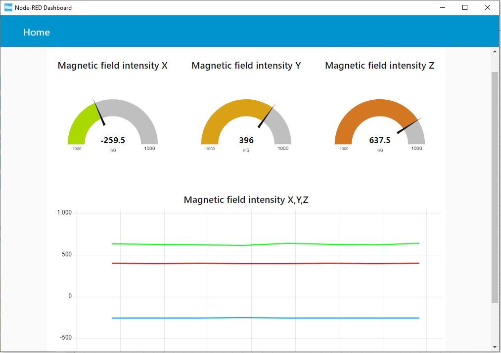

This document walks you through setting up a Ubuntu PC, downloading and compiling the OpenSTLinux distribution, flashing the evaluation kit and testing the AWS IoT Greengrass V2 services.

Required H/W:
- Ubuntu 18.04 or 20.04 machine
- WiFi hotspot
- STM32MP157C-DK2 board or STM32MP157A-DK1 with Edimax EW-7811un-V2 WiFi dongle
- X-NUCLEO-IKS01A3 sensor shield

# Setup the development environment on your host computer

## 1. Create the development workspace on your host computer

1. Open a terminal and setup your workspace

> ```bash
> PC $> mkdir $HOME/STM32MPU_workspace
> PC $> cd $HOME/STM32MPU_workspace
> ```

2. Check host internet access

> ```bash
> PC $> wget -q www.google.com && echo "Internet access over HTTP/HTTPS is OK !" || echo "No internet access over HTTP/HTTPS ! You may need to set up a proxy."
> ```

​	==> Should provide you the following terminal output if your internet connection is ok


3. Allow internet over git://, ssh:// and others specifics protocols *(skip this part if no proxy is used to access internet)*

   In addition to http/https protocols (used in 90% of the Internet traffic), some other protocols like git:// or ssh:// may be required

   For example in the context of the *Distribution Package*, some "git fetch" commands could require "git:// protocols"

   In order to support these protocols through a proxy, the best way is to directly setup the proxy in the $HOME/.gitconfig file (core.gitproxy) and use a tool like *corkscrew* in order to tunnel the git:// flow into the http flow

> ```bash
> PC $> sudo apt-get update
> PC $> sudo apt-get install corkscrew
> 
> PC $> git config --replace-all --global core.gitproxy "$HOME/bin/git-proxy.sh"
> PC $> git config --add --global core.gitproxy "none for <MyPrivateNetworkDomain>" (optionnal and for example .st.com, localhost, ...)
> PC $> echo 'exec corkscrew <MyProxyServerUrl> <MyProxyPort> $* $HOME/.git-proxy.auth' > $HOME/bin/git-proxy.sh
> PC $> chmod 700 $HOME/bin/git-proxy.sh
> PC $> echo '<MyProxyLogin>:<MyProxyPassword>' > $HOME/.git-proxy.auth
> PC $> chmod 600 $HOME/.git-proxy.auth
> ```

​	Here is a command to test this proxy settings:

> ```bash
> PC $> git ls-remote git://git.openembedded.org/openembedded-core > /dev/null && echo OK || echo KO
> ```

​	==> This command should return *OK* else the proxy settings are wrong


------

## 2. Install STM32CubeProgrammer on your host computer

1. Install Java platform version 1.8 required by STM32CubeProgrammer

> ```bash
> PC $> sudo apt-get install openjdk-8-jre-headless
> PC $> sudo update-alternatives --config java
> ```

​	==> Select the java-8-openjdk configuration

2. Install OpenJFX for Ubuntu® 18.04

> ```bash
> PC $> sudo apt purge openjfx
> PC $> sudo apt install openjfx=8u161-b12-1ubuntu2 libopenjfx-jni=8u161-b12-1ubuntu2 libopenjfx-java=8u161-b12-1ubuntu2
> PC $> sudo apt-mark hold openjfx libopenjfx-jni libopenjfx-java
> ```

3. Create your STM32MPU tools directory

> ```bash
> PC $> mkdir -p $HOME/STM32MPU_workspace/STM32MPU_tools/STM32CubeProgrammer-2.5.0
> ```

4. Create a temporary directory in your STM32MPU workspace

> ```bash
> PC $> mkdir $HOME/STM32MPU_workspace/tmp
> ```

5. Download the latest [STM32CubeProgrammer][STM32CubeProgrammer download link] in `$HOME/STM32MPU_workspace/tmp`

[STM32CubeProgrammer download link]: https://www.st.com/en/development-tools/stm32cubeprog.html#getsoftware-scroll

*Note: If you cannot download the installation file, you can find it as well in the provided USB flash drive inside the folder 1.STM32CubeProgrammer_installation, please copy this installation file in `$HOME/STM32MPU_workspace/tmp`*

6. Decompress the archive file to get the STM32CubeProgrammer installers

> ```bash
> PC $> cd $HOME/STM32MPU_workspace/tmp
> PC $> unzip en.stm32cubeprog_v2-5-0.zip
> ```

7. Execute the Linux installer which guides you through the installation process

> ```bash
> PC $> ./SetupSTM32CubeProgrammer-2.5.0.linux
> ```

​	==> Select $HOME/STM32MPU_workspace/STM32MPU_tools/STM32CubeProgrammer-2.5.0 as the installation directory

8. Add the STM32CubeProgrammer binary path to your PATH environment variable (or .bashrc)

> ```bash
> PC $> export PATH=$HOME/STM32MPU_workspace/STM32MPU_tools/STM32CubeProgrammer-2.5.0/bin:$PATH
> ```

9. Check that the STM32CubeProgrammer tool is properly installed and accessible

> ```bash
> PC $> STM32_Programmer_CLI --h
> ```

​	==> Should provide you the following terminal output


------

## 3. Install USB serial link on your host computer

1. Install the libusb

> ```bash
> PC $> sudo apt-get install libusb-1.0-0
> ```

2. Allow STM32CubeProgrammer to access to the USB port through low-level commands

> ```bash
> PC $> cd $HOME/STM32MPU_workspace/STM32MPU_tools/STM32CubeProgrammer-2.5.0/Drivers/rules
> PC $> sudo cp *.* /etc/udev/rules.d/
> ```


------
## 4. Install extra packages
Additional Ubuntu packages must be installed to perform basic development tasks, basic cross-compilation or more complex cross-compilation such as OpenEmbedded does:
1. Packages required by OpenEmbedded/Yocto:
> ```bash
> PC $> sudo apt-get update
> PC $> sudo apt-get install gawk wget git-core diffstat unzip texinfo gcc-multilib build-essential chrpath socat cpio python3 python3-pip python3-pexpect xz-utils debianutils iputils-ping python3-git python3-jinja2 libegl1-mesa libsdl1.2-dev pylint3 pylint xterm
> PC $> sudo apt-get install make xsltproc docbook-utils fop dblatex xmlto
> PC $> sudo apt-get install libmpc-dev libgmp-dev
> ```
2. Packages needed for some "Developer Package" use cases:
> ```bash
> PC $> sudo apt-get install libncurses5 libncurses5-dev libncursesw5-dev libssl-dev linux-headers-generic u-boot-tools device-tree-compiler bison flex g++ libyaml-dev libmpc-dev libgmp-dev
> ```
3. Package for repo (used to download the "Distribution Package" source code):
Please follow the installation instructions described in https://source.android.com/setup/develop#installing-repo
Note: if command "repo init" returns "/usr/bin/env: ‘python’: No such file or directory" please execute the following command:

> ```bash
> PC $> sudo ln -s /usr/bin/python3 /usr/bin/python
> ```
------


# Build a package including AWS IoT Greengrass V2 services

## 1. Using OpenSTLinux Distribution Package

The STM32MP1 OpenSTLinux distribution is delivered through a manifest repository location and a manifest revision (*openstlinux-5.10-dunfell-mp1-21-03-31*)
For the needs of this workshop, however, we are going to use a different manifest based on the official one with the additions of the layers related to the AWS IoT Greengrass V2 package.


1. Create your STM32MP15x Distribution Package directory & sub-directory

> ```bash
> PC $> mkdir -p $HOME/STM32MPU_workspace/STM32MP15-Ecosystem-v3.0.0/Distribution-Package/openstlinux-5.10-dunfell-mp1-21-03-31-st-aws-ggv2
> ```

2. Go to `$HOME/STM32MPU_workspace/STM32MP15-Ecosystem-v3.0.0/Distribution-Package/openstlinux-5.10-dunfell-mp1-21-03-31-st-aws-ggv2` directory

> ```bash
> PC $> cd $HOME/STM32MPU_workspace/STM32MP15-Ecosystem-v3.0.0/Distribution-Package/openstlinux-5.10-dunfell-mp1-21-03-31-st-aws-ggv2
> ```

3. The installation relies on the repo command. First initialize repo in the current directory

> ```bash
> PC $> repo init -u  https://github.com/ARaffalli-STM/wk-manifest.git -b refs/tags/openstlinux-5.10-dunfell-mp1-21-03-31-st-aws-ggv2
> ```

4. Then synchronize the local project directories with the remote repositories specified in the manifest

> ```bash
> PC $> repo sync
> ```

​	==> Note: Distribution package needs around 140MB to be installed (and around 25GB once distribution package is compiled)

The OpenSTLinux distribution installation directory is then populated with the "layers" directory:

> ```
> openstlinux-5.10-dunfell-mp1-21-03-31-st-aws-ggv2  OpenSTLinux distribution with AWS IoT Greengrass V2 packages
> ├── layers 
> │    ├── meta-openembedded                Collection of layers for the OpenEmbedded-Core universe (OpenEmbedded standard)
> │    ├── meta-qt5                         QT5 layer for OpenEmbedded (standard)
> │    ├── meta-st
> │    │   ├── meta-st-openstlinux          STMicroelectronics layer that contains the frameworks and images settings for the OpenSTLinux distribution
> │    │   ├── meta-st-stm32mp              STMicroelectronics layer that contains the description of the BSP for the STM32 MPU devices
> │    │   │   ├── recipes-bsp
> │    │   │   │   ├── alsa                 Recipes for ALSA control configuration
> │    │   │   │   ├── drivers              Recipes for Vivante GCNANO GPU kernel drivers
> │    │   │   │   ├── trusted-firmware-a   Recipes for TF-A
> │    │   │   │   └── u-boot               Recipes for U-Boot
> │    │   │   ├── recipes-extended
> │    │   │   │   ├── linux-examples       Recipes for Linux examples for STM32 MPU devices
> │    │   │   │   ├── m4coredump           Recipes for script to manage coredump of cortexM4
> │    │   │   │   └── m4projects           Recipes for firmware examples for Cortex M4
> │    │   │   ├── recipes-graphics
> │    │   │   │   ├── gcnano-userland      Recipes for Vivante libraries OpenGL ES, OpenVG and EGL (multi backend)
> │    │   │   │   └── [...]
> │    │   │   ├── recipes-kernel
> │    │   │   │   ├── linux                Recipes for Linux kernel
> │    │   │   │   └── linux-firmware       Recipes for Linux firmwares (example, Bluetooth firmware)
> │    │   │   ├── recipes-security
> │    │   │   │   └── optee                Recipes for OPTEE
> │    │   │   ├── recipes-st
> │    │   │   │   └── images               Recipes for the bootfs and userfs partitions binaries
> │    │   │   └── [...]
> │    │   ├── meta-st-stm32mp-addons       STMicroelectronics layer that helps managing the STM32CubeMX integration
> │    │   ├── scripts
> │    │   │    ├── envsetup.sh             Environment setup script for Distribution Package
> │    │   │    └── [...]
> │    │   └── AP-meta-st-aws_ggv2		    STMicroelectronics layer that contains additional machine and image for AWS IoT Greengrass V2 workshop
> │    ├── openembedded-core               Core metadata for current versions of OpenEmbedded (standard)
> │    └── meta-aws                        Layer provinding recipes for building in AWS edge software capabilities to Embedded Linux 
> ```


### 1.1 Initializing the OpenEmbedded build environment

==> The OpenEmbedded environment setup script must be run once in each new working terminal in which you use the BitBake or devtool tools

> ```bash
> PC $> cd $HOME/STM32MPU_workspace/STM32MP15-Ecosystem-v3.0.0/Distribution-Package/openstlinux-5.10-dunfell-mp1-21-03-31-st-workshop
> PC $> DISTRO=openstlinux-weston MACHINE=stm32mp1-aws-ggv2 source layers/meta-st/scripts/envsetup.sh
> ```

The BSP for STM32MP1 depends on packages and firmware which are covered by a **[software license agreement (SLA)](https://wiki.st.com/stm32mpu/wiki/OpenSTLinux_licenses#Top_Software_license_agreement_.28SLA.29_and_third-party_licences)**. You will be asked to read and to accept this EULA

Note that:

- *openstlinux-weston* (OpenSTLinux distribution featuring Weston/Wayland) and *stm32mp1-workshop* (stm32mp1 machine plus the IoTEdge packages) are the values for *DISTRO* and *MACHINE* to be used for the workshop
- Other values for *DISTRO* and *MACHINE* are proposed in OpenSTLinux distribution

Among other things, the environment setup script creates the **build directory** named **build-openstlinuxweston-stm32mp1-workshop**. After the script runs, the current working directory is set to this build directory. When the build completes, it contains all the files created during the build

The local configuration file (*build-openstlinuxweston-stm32mp1-workshop/conf/local.conf*) contains all local user settings. The layers configuration file (*build-openstlinuxweston-stm32mp1/conf/bblayers.conf*) tells BitBake which layers must be considered during the build

> ```
> openstlinux-5.10-dunfell-mp1-21-03-31-st-workshop	OpenSTLinux distribution
> ├── build-openstlinuxweston-stm32mp1	Build directory
> │   ├── conf
> │   │   ├── bblayers.conf				Local configuration file
> │   │   ├── local.conf					Layers configuration file
> │   │   └── [...]
> │   └── workspace
> ├── layers
> │   ├── meta-openembedded
> │   ├── [...]
> ```

3. Build the image

   To build the image, execute the following command in the folder `$HOME/STM32MPU_workspace/STM32MP15-Ecosystem-v2.0.0/Distribution-Package/openstlinux-5.10-dunfell-mp1-21-03-31-st-workshop/build-openstlinuxweston-stm32mp1-workshop`

*Note: This operation is taking a lot of time, between 4 to 6hours so we will not execute it, rather we will provide the output images that have been created in a USB flash drive and are inside the folder 4.OpenSTLinux_IoTEdge*

> ```bash
> PC $> bitbake st-workshop-image
> ```


------

## 2. Flash the SD Card with the built package

<!-- The previous build is provided in a USB flash drive in the *4.OpenSTLinux_IoTEdge* folder and is called *stm32mp1.zip*

1. Copy the *stm32mp1.zip* file in `$HOME/STM32MPU_workspace/tmp`

> ```bash
> PC $> cp <path_to_USB_flash_drive>/4.OpenSTLinux_IoTEdge/stm32mp1.zip $HOME/STM32MPU_workspace/tmp
> ```

2. Move to `$HOME/STM32MPU_workspace/tmp` and unzip the *stm32mp1.zip* file

> ```bash
> PC $> cd $HOME/STM32MPU_workspace/tmp
> PC $> unzip stm32mp1.zip
> ```
-->
1. Move to the compiled images directory

> ```bash
> PC $> cd $HOME/STM32MPU_workspace/STM32MP15-Ecosystem-v3.0.0/Distribution-Package/openstlinux-5.10-dunfell-mp1-21-03-31-st-workshop/tmp-glibc/deploy/images/stm32mp1-workshop/
> ```

2. Set the boot switches (located at the back of the board) to the off position


3. Connect an USB Type A to Type C cable between your PC and CN7 (USB) connector (SD Card programming port)
4. Connect an USB Type A to Type C cable between your PC and CN6 (PWR_IN) connector (board power supply)
5. Press the reset button to reset the board
6. Use STM32CubeProgrammer in command line interface mode to program the board SD Card

- Check the USB port where the board is connected

> ```bash
> PC $> STM32_Programmer_CLI -l
> ```

==> Will return something like this (*USB1* is the port to be used)

> ```bash
> =====  DFU Interface   =====
> 
> Total number of available STM32 device in DFU mode: 1
> 
>   Device Index           : USB1
>   USB Bus Number         : 001
>   USB Address Number     : 002
>   Product ID             : DFU in HS Mode @Device ID /0x500, @Revision ID /0x0000
>   Serial number          : 003A00293338510739303435
>   Firmware version       : 0x0110
>   Device ID              : 0x0500
> 
> ===== STLink Interface =====
> Error: No ST-Link detected!
> 
> =====  UART Interface  =====
> 
> Total number of serial ports available: 0
> ```

- Program the SD Card with all the images

> ```bash
> PC $> STM32_Programmer_CLI -c port=usb1 -w ./flashlayout_st-workshop-image/trusted/FlashLayout_sdcard_stm32mp157c-dk2-trusted.tsv
> ```

7. Disconnect the USB Type A to Type C cable between your PC and CN7 (USB) connector (SDCard programming port)

8. Disconnect the USB Type A to Type C cable between your PC and CN6 (PWR_IN) connector (board power supply)

9. Set the boot switches (located at the back of the board) to the ON position


------

## 3. Install a serial terminal on your host computer

The serial terminal allows to communicate with the board trough a UART serial interface

1. Connect an USB Type A to micro USB Type B cable between your PC and CN11 (ST-LINK) connector (debug port)
2. Connect an USB Type A to Type C cable between your PC and CN6 (PWR_IN) connector (board power supply)
3. Install minicom

> ```bash
> PC $> sudo apt-get install minicom
> ```

4. Get the ttyACM device instance that need to be used to access the ST-LINK/V2-1

> ```bash
> PC $> ls /dev/ttyACM*
> /dev/ttyACM0
> ```

5. Connect the minicom to the /dev/ttyACM0 device

> ```bash
> PC $> minicom -D /dev/ttyACM0
> Welcome to minicom 2.7
> 
> OPTIONS: I18n 
> Compiled on Nov 15 2018, 20:18:47.
> Port /dev/ttyACM0, 15:56:03
> 
> Press CTRL-A Z for help on special keys
> ```

6. Press the reset button to reset the board. You should see boot log displayed in the minicom window

> ```bash
> NOTICE:  CPU: STM32MP157AAC Rev.B
> NOTICE:  Model: STMicroelectronics STM32MP157A-DK1 Discovery Board
> NOTICE:  Board: MB1272 Var1.0 Rev.C-01
> INFO:    Reset reason (0x14):
> INFO:      Pad Reset from NRST
> INFO:    PMIC version = 0x10
> INFO:    FCONF: Reading TB_FW firmware configuration file from: 0x2ffe3000
> INFO:    FCONF: Reading firmware configuration information for: stm32mp_io
> INFO:    Using SDMMC
> INFO:      Instance 1
> INFO:    Boot used partition fsbl1
> NOTICE:  BL2: v2.4-r1.0(debug):v2.4-dirty
> NOTICE:  BL2: Built : 16:43:51, Nov 17 2020
> INFO:    BL2: Doing platform setup
> INFO:    RAM: DDR3-DDR3L 16bits 533000Khz
> WARNING: Couldn't find property st,phy-cal in dtb
> INFO:    Memory size = 0x20000000 (512 MB)
> ...
> [  OK  ] Started Weston Wayland Compositor (on tty7).
> 
> ST OpenSTLinux - Weston - (A Yocto Project Based Distro) 3.1-snapshot stm32mp1-workshop ttySTM0
> 
> stm32mp1-workshop login: root (automatic login)
> 
> Last login: Sun Sep 20 10:44:12 UTC 2020 on tty7
> root@stm32mp1:~# [   34.394093] usb33: supplied by vdd_usb
> [   34.396622] vref: supplied by vdd
> [   34.399912] vref: disabling
> [   34.411810] vdda: disabling
> 
> root@stm32mp1-workshop:~#
> ```

------

# Add sensing and wireless connectivity

This chapter will explain how to connect the X-NUCLEO-IKS01A3 sensor shield on the STM32MP157C-DK2/STM32MP157A-DK1 and read the sensor outputs.
This chapter will also give a few command lines to setup a connection to a WiFi hotspot

The X-NUCLEO-IKS01A3 sensor shield is an Arduino expansion board that includes several sensors like

* Accelerometer (LIS2DW12)
* Gyroscope (LSM6DS0)
* Magnetic sensor (LIS2MDL)
* Pressure sensor (LPS22HH)
* Humidity and temperature (HTS221)
* Temperature (STTS751)


## 1. Hardware configuration

### 1.1 Platforms

​		First you have to connect the X-NUCLEO-IKS01A3 sensor shield on the Arduino connectors under the STM32MP157C-DK2/STM32MP157A-DK1 board

​		**STM32MP157A-DK1 board**


​		**X-NUCLEO-IKS01A3 sensor shield**


Note: the Linux kernel and kernel device tree have have been patched from the standard delivery to include the support of some sensors on the X-NUCLEO-IKS01A3 sensor shield.

### 1.2 Connectivity details

According to X-NUCLEO-IKS01A3 [user manual][X-NUCLEO-IKS01A3 user manual], all the sensors on the board are controlled by I2C bus

Looking at X-NUCLEO-IKS01A3 schematics in the user manual, we understand that all the I2C buses of the sensors are wired together via jumpers JP7 and JP8 and routed to Arduino connector CN5 pins 9 (SDA) and 10 (SCL)

In addition, pins 5 and 6 of Arduino connector CN9 are used to manage LSM6DSL motion MEMS interruptions (indicated for information, not used on kernel configuration)

[X-NUCLEO-IKS01A3 user manual]: https://www.st.com/resource/en/user_manual/dm00601501-getting-started-with-the-xnucleoiks01a3-motion-mems-and-environmental-sensor-expansion-board-for-stm32-nucleo-stmicroelectronics.pdf

 

Then looking at STM32MP157Z-DK1 schematics in the [user manual][STM32MP157A-DK1 user manual], we understand that Arduino connector CN13 pins 9 (SDA) and 10 (SCL) are connected to the I2C5 of STM32MP157A

[STM32MP157A-DK1 user manual ]: https://www.st.com/content/ccc/resource/technical/layouts_and_diagrams/schematic_pack/group0/36/8e/ea/7a/ca/ca/4b/e4/mb1272-dk2-c01_schematic/files/MB1272-DK2-C01_Schematic.pdf/jcr:content/translations/en.MB1272-DK2-C01_Schematic.pdf

In addition, pins 5 and 6 of Arduino connector CN14 are used to manage LSM6DSL motion MEMS interruptions (indicated for information, not used on kernel configuration)


## 2. Software configuration

### 2.1 Kernel device tree configuration

The kernel is already configured to support the the following 3 sensors on the X-NUCLEO-IKS01A3 sensor shield: lis2dw12 (accelerometer), lis2mdl (magnetometer) and hts221 (temperature and humidity sensor).
This is done using the recipe  $HOME/STM32MPU_workspace/STM32MP15-Ecosystem-v3.0.0/Distribution-Package/openstlinux-5.10-dunfell-mp1-21-03-31-st-aws-ggv2/layers/meta-st/AP-meta-st-aws_ggv2/recipes-kernel/linux/linux-stm32mp_5.10.bbappend

You may verify the availability of the 3 sensors using the following command:
> ```bash
> Board $> grep OF_NAME /sys/bus/iio/devices/iio\:device*/uevent
> /sys/bus/iio/devices/iio:device0/uevent:OF_NAME=hts221
> /sys/bus/iio/devices/iio:device1/uevent:OF_NAME=lis2dw12
> /sys/bus/iio/devices/iio:device2/uevent:OF_NAME=lis2mdl
> 


#### 2.2 Read the sensors data

A python script is available to read and display the sensors value on a GUI:

> ```bash
> board $> python3 read_sensor.py
> ```
   
We can read from the accelerometer sensor using the following command (note that there is a latency of about 10-20 seconds before the command returns)

> ```bash
> board $> ./read_sensor.sh acc
> ```

From the magnetometer sensor using the following command

> ```bash
> board $> ./read_sensor.sh mag
> ```

And from the temperature sensor using the following command

> ```bash
> board $> ./read_sensor.sh hum
> ```

#### 2.3 Connecting the STM32MP157C-DK2 board to a Wi-Fi access point

The goal is to configure an wlan network interface via systemd-networkd configuration

In order to attach this wireless interface to a specific network, we need to have some information like the network SSID and password

Type the following command in order to see the list of wireless network available

> ```bash
> Board $> ifconfig wlan0 up
> Board $> iw dev wlan0 scan | grep SSID
>     SSID: NETWORK1
>     SSID: NETWORK2
> ```

Associate the wireless network to the wireless interface, here *wlan0*

> ```bash
> Board $> wpa_passphrase SSID_OF_NETWORK PASSWORD_OF_NETWORK >> /etc/wpa_supplicant/wpa_supplicant-wlan0.conf
> ```

Where *SSID_OF_NETWORK = msedgeworkshop* and *PASSWORD_OF_NETWORK = STAventM$TM999* during this workshop

Last, in order to enable and start the wireless configuration, type the following command

> ```bash
> Board $> systemctl enable wpa_supplicant@wlan0.service
> Board $> systemctl restart systemd-networkd.service
> Board $> systemctl restart wpa_supplicant@wlan0.service
> ```

Your board should be now connected to the network and internet, you can verify with the following command

> ```bash
> Board $> ping www.google.com
> ```

#### 2.4 Connecting the STM32MP157A-DK1 board to a Wi-Fi access point

The goal is to configure an wlan network interface

In order to attach this wireless interface to a specific network, we need to have some information like the network SSID and password, please get them from the trainer

Associate the wireless network to the wireless interface, here *wlan0*

> ```bash
> Board $> wpa_passphrase SSID_OF_NETWORK PASSWORD_OF_NETWORK >> /etc/wpa_supplicant/wpa_supplicant-wlan0.conf
> ```

Where *SSID_OF_NETWORK = msedgeworkshop* and *PASSWORD_OF_NETWORK = STAventM$TM999* during this workshop

Last, in order to enable and start the wireless configuration, type the following command

> ```bash
> Board $> wpa_supplicant -i wlan0 -D wext -c /etc/wpa_supplicant/wpa_supplicant-wlan0.conf -B
> Successfully initialized wpa_supplicant
> rfkill: Cannot get wiphy information
> [  176.854543] MAC Address = 08:be:ac:0d:7f:95
> ioctl[SIOCSIWAP]: Operation not permitted
> Board $> [  178.814860] R8188EU: assoc success
> [  178.901592] IPv6: ADDRCONF(NETDEV_CHANGE): wlan0: link becomes ready
> Board $> dhclient wlan0
> ```

Note: once you see "R8188EU: assoc success" and "wlan0: link becomes ready", it means that the wifi interface bring-up is successful.
   
Your board should be now connected to the network and internet, you can verify with the following command

> ```bash
> Board $> ping www.google.com
> ```

#### 2.5 Monitor the magnetometer measurment using STM32CubeMonitor on PC

1. Download and install the latest [STM32CubeMonitor ][STM32CubeProgrammer download link] 

[STM32CubeProgrammer download link]: https://www.st.com/content/st_com/en/products/development-tools/software-development-tools/stm32-software-development-tools/stm32-performance-and-debuggers/stm32cubemonitor.html

2. Boot the board and connect it to the host PC via ST-Link port 

3. Open a console attached to the serial link offered by ST-Link and execute the following commmand:

> ```bash
> Board $> while true; do ./read_sensor.sh mag | tail -n 1 | sed -e 's/Magnetometer value: \[ //'  | sed -e 's/\]//' | sed -e 's/ //g'; sleep 0.2; done
> -498.00,955.50,690.00                                                           
> -484.50,954.00,687.00                                                           
> -492.00,957.00,693.00                                                           
> -486.00,963.00,697.50                                                           
> -493.50,960.00,682.50
> ```
If you get an output similar to the above, please close the console application.
   
4. Open STM32CubeMonitor on the UBUNTU PC and import magnetometer_gauge.json from meta-st-iot_engine/PC-tools/

5. Press "DEPLOY", then press "DASHBOARD"


