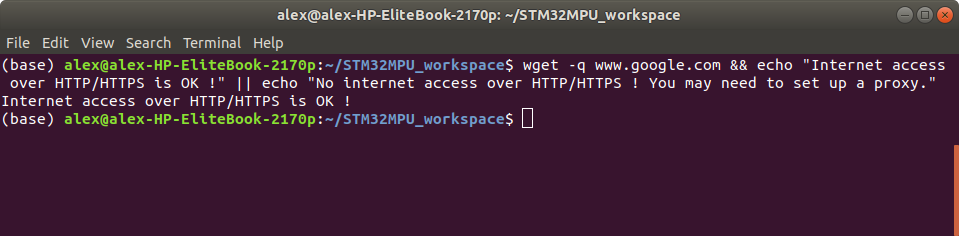
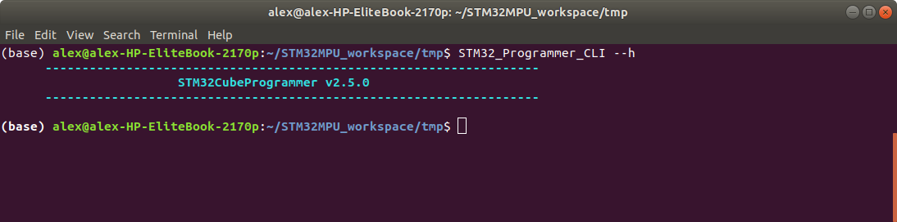
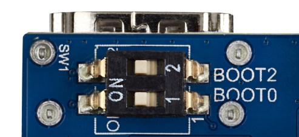
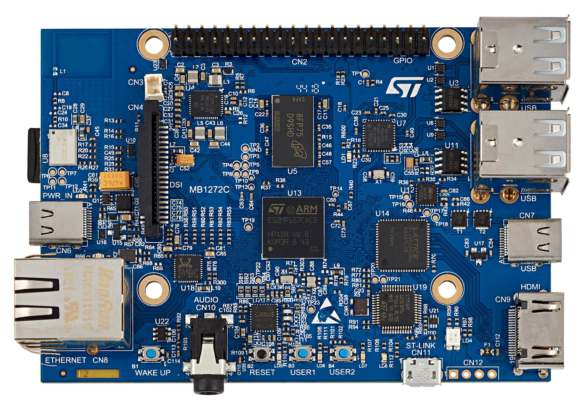
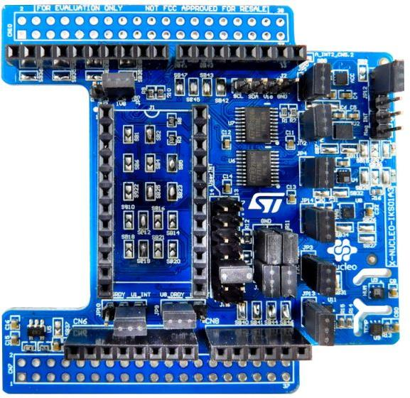
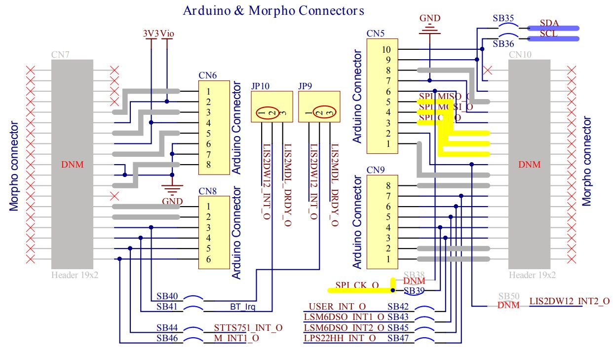
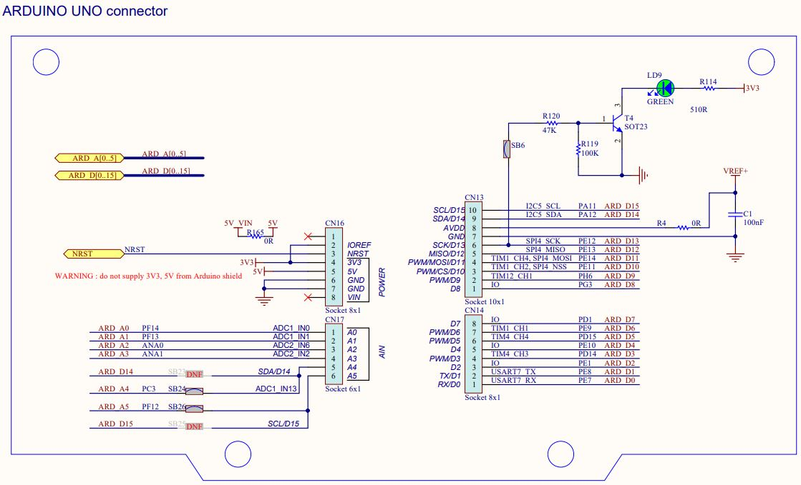

# Setup the development environment on your host computer

## 1. Create the development workspace on your host computer

1. Open a terminal and setup your workspace

> ```bash
> PC $> mkdir $HOME/STM32MPU_workspace
> PC $> cd $HOME/STM32MPU_workspace
> ```

2. Check host internet access

> ```bash
> PC $> wget -q www.google.com && echo "Internet access over HTTP/HTTPS is OK !" || echo "No internet access over HTTP/HTTPS ! You may need to set up a proxy."
> ```

​	==> Should provide you the following terminal output if your internet connection is ok



3. Allow internet over git://, ssh:// and others specifics protocols *(skip this part if no proxy is used to access internet)*

   In addition to http/https protocols (used in 90% of the Internet traffic), some other protocols like git:// or ssh:// may be required

   For example in the context of the *Distribution Package*, some "git fetch" commands could require "git:// protocols"

   In order to support these protocols through a proxy, the best way is to directly setup the proxy in the $HOME/.gitconfig file (core.gitproxy) and use a tool like *corkscrew* in order to tunnel the git:// flow into the http flow

> ```bash
> PC $> sudo apt-get update
> PC $> sudo apt-get install corkscrew
> 
> PC $> git config --replace-all --global core.gitproxy "$HOME/bin/git-proxy.sh"
> PC $> git config --add --global core.gitproxy "none for <MyPrivateNetworkDomain>" (optionnal and for example .st.com, localhost, ...)
> PC $> echo 'exec corkscrew <MyProxyServerUrl> <MyProxyPort> $* $HOME/.git-proxy.auth' > $HOME/bin/git-proxy.sh
> PC $> chmod 700 $HOME/bin/git-proxy.sh
> PC $> echo '<MyProxyLogin>:<MyProxyPassword>' > $HOME/.git-proxy.auth
> PC $> chmod 600 $HOME/.git-proxy.auth
> ```

​	Here is a command to test this proxy settings:

> ```bash
> PC $> git ls-remote git://git.openembedded.org/openembedded-core > /dev/null && echo OK || echo KO
> ```

​	==> This command should return *OK* else the proxy settings are wrong


------

## 2. Install STM32CubeProgrammer on your host computer

1. Install Java platform version 1.8 required by STM32CubeProgrammer

> ```bash
> PC $> sudo apt-get install openjdk-8-jre-headless
> PC $> sudo update-alternatives --config java
> ```

​	==> Select the java-8-openjdk configuration

2. Install OpenJFX for Ubuntu® 18.04

> ```bash
> PC $> sudo apt purge openjfx
> PC $> sudo apt install openjfx=8u161-b12-1ubuntu2 libopenjfx-jni=8u161-b12-1ubuntu2 libopenjfx-java=8u161-b12-1ubuntu2
> PC $> sudo apt-mark hold openjfx libopenjfx-jni libopenjfx-java
> ```

3. Create your STM32MPU tools directory

> ```bash
> PC $> mkdir -p $HOME/STM32MPU_workspace/STM32MPU_tools/STM32CubeProgrammer-2.5.0
> ```

4. Create a temporary directory in your STM32MPU workspace

> ```bash
> PC $> mkdir $HOME/STM32MPU_workspace/tmp
> ```

5. Download the latest [STM32CubeProgrammer][STM32CubeProgrammer download link] in `$HOME/STM32MPU_workspace/tmp`

[STM32CubeProgrammer download link]: https://www.st.com/en/development-tools/stm32cubeprog.html#getsoftware-scroll

*Note: If you cannot download the installation file, you can find it as well in the provided USB flash drive inside the folder 1.STM32CubeProgrammer_installation, please copy this installation file in `$HOME/STM32MPU_workspace/tmp`*

6. Decompress the archive file to get the STM32CubeProgrammer installers

> ```bash
> PC $> cd $HOME/STM32MPU_workspace/tmp
> PC $> unzip en.stm32cubeprog_v2-5-0.zip
> ```

7. Execute the Linux installer which guides you through the installation process

> ```bash
> PC $> ./SetupSTM32CubeProgrammer-2.5.0.linux
> ```

​	==> Select $HOME/STM32MPU_workspace/STM32MPU_tools/STM32CubeProgrammer-2.5.0 as the installation directory

8. Add the STM32CubeProgrammer binary path to your PATH environment variable (or .bashrc)

> ```bash
> PC $> export PATH=$HOME/STM32MPU_workspace/STM32MPU_tools/STM32CubeProgrammer-2.5.0/bin:$PATH
> ```

9. Check that the STM32CubeProgrammer tool is properly installed and accessible

> ```bash
> PC $> STM32_Programmer_CLI --h
> ```

​	==> Should provide you the following terminal output




------

## 3. Install USB serial link on your host computer

1. Install the libusb

> ```bash
> PC $> sudo apt-get install libusb-1.0-0
> ```

2. Allow STM32CubeProgrammer to access to the USB port through low-level commands

> ```bash
> PC $> cd $HOME/STM32MPU_workspace/STM32MPU_tools/STM32CubeProgrammer-2.5.0/Drivers/rules
> PC $> sudo cp *.* /etc/udev/rules.d/
> ```


------


# Build a package including Microsoft® Azure IoT Edge services

## 1. Using OpenSTLinux Distribution Package

The STM32MP1 OpenSTLinux distribution is delivered through a manifest repository location and a manifest revision (*openstlinux-5.10-dunfell-mp1-21-03-31*)
For the needs of this workshop, however, we are going to use a different reposity based on the official one with the additions of the layers related to the Microsoft® Azure IoTEdge packages and dependencies (meta-iotedge, meta-rust and meta-virtualization).


1. Create your STM32MP15x Distribution Package directory & sub-directory

> ```bash
> PC $> mkdir -p $HOME/STM32MPU_workspace/STM32MP15-Ecosystem-v3.0.0/Distribution-Package/openstlinux-5.10-dunfell-mp1-21-03-31-st-workshop
> ```

2. Go to `$HOME/STM32MPU_workspace/STM32MP15-Ecosystem-v3.0.0/Distribution-Package/openstlinux-5.10-dunfell-mp1-21-03-31-st-workshop` directory

> ```bash
> PC $> cd $HOME/STM32MPU_workspace/STM32MP15-Ecosystem-v3.0.0/Distribution-Package/openstlinux-5.10-dunfell-mp1-21-03-31-st-workshop
> ```

3. The installation relies on the repo command. First initialize repo in the current directory

> ```bash
> PC $> repo init -u  https://github.com/ARaffalli-STM/wk-manifest.git -b refs/tags/openstlinux-5.10-dunfell-mp1-21-03-31-st-workshop-dk1-dk2
> ```

4. Then synchronize the local project directories with the remote repositories specified in the manifest

> ```bash
> PC $> repo sync
> ```

​	==> Note: Distribution package needs around 140MB to be installed (and around 25GB once distribution package is compiled)

The OpenSTLinux distribution installation directory is then populated with the "layers" directory:

> ```
> openstlinux-5.10-dunfell-mp1-21-03-31-st-workshop  OpenSTLinux distribution with Microsoft® Azure IoTEdge workshop packages
> ├── layers 
> │    ├── meta-openembedded                Collection of layers for the OpenEmbedded-Core universe (OpenEmbedded standard)
> │    ├── meta-qt5                         QT5 layer for OpenEmbedded (standard)
> │    ├── meta-st
> │    │   ├── meta-st-openstlinux          STMicroelectronics layer that contains the frameworks and images settings for the OpenSTLinux distribution
> │    │   ├── meta-st-stm32mp              STMicroelectronics layer that contains the description of the BSP for the STM32 MPU devices
> │    │   │   ├── recipes-bsp
> │    │   │   │   ├── alsa                 Recipes for ALSA control configuration
> │    │   │   │   ├── drivers              Recipes for Vivante GCNANO GPU kernel drivers
> │    │   │   │   ├── trusted-firmware-a   Recipes for TF-A
> │    │   │   │   └── u-boot               Recipes for U-Boot
> │    │   │   ├── recipes-extended
> │    │   │   │   ├── linux-examples       Recipes for Linux examples for STM32 MPU devices
> │    │   │   │   ├── m4coredump           Recipes for script to manage coredump of cortexM4
> │    │   │   │   └── m4projects           Recipes for firmware examples for Cortex M4
> │    │   │   ├── recipes-graphics
> │    │   │   │   ├── gcnano-userland      Recipes for Vivante libraries OpenGL ES, OpenVG and EGL (multi backend)
> │    │   │   │   └── [...]
> │    │   │   ├── recipes-kernel
> │    │   │   │   ├── linux                Recipes for Linux kernel
> │    │   │   │   └── linux-firmware       Recipes for Linux firmwares (example, Bluetooth firmware)
> │    │   │   ├── recipes-security
> │    │   │   │   └── optee                Recipes for OPTEE
> │    │   │   ├── recipes-st
> │    │   │   │   └── images               Recipes for the bootfs and userfs partitions binaries
> │    │   │   └── [...]
> │    │   ├── meta-st-stm32mp-addons       STMicroelectronics layer that helps managing the STM32CubeMX integration
> │    │   ├── scripts
> │    │   │    ├── envsetup.sh             Environment setup script for Distribution Package
> │    │   │    └── [...]
> │    │   └── meta-st-workshop		        STMicroelectronics layer that contains additional machine and image for Microsoft® Azure IoTEdge workshop
> │    ├── meta-timesys                     Timesys layer for OpenEmbedded (standard)
> │    ├── openembedded-core                Core metadata for current versions of OpenEmbedded (standard)
> │    ├── meta-iotedge                		This layer provides support for building IoT Edge.
> │    ├── meta-rust                		This OpenEmbedded layer provides the rust compiler, tools for building packages (cargo), and a few example projects
> │    └── meta-virtualization              Layer enabling hypervisor, virtualization tool stack, and cloud support
> ```


### 1.1 Initializing the OpenEmbedded build environment

==> The OpenEmbedded environment setup script must be run once in each new working terminal in which you use the BitBake or devtool tools

> ```bash
> PC $> cd $HOME/STM32MPU_workspace/STM32MP15-Ecosystem-v3.0.0/Distribution-Package/openstlinux-5.10-dunfell-mp1-21-03-31-st-workshop
> PC $> DISTRO=openstlinux-weston MACHINE=stm32mp1-workshop source layers/meta-st/scripts/envsetup.sh
> ```

The BSP for STM32MP1 depends on packages and firmware which are covered by a **[software license agreement (SLA)](https://wiki.st.com/stm32mpu/wiki/OpenSTLinux_licenses#Top_Software_license_agreement_.28SLA.29_and_third-party_licences)**. You will be asked to read and to accept this EULA

Note that:

- *st-workshop-image* (OpenSTLinux distribution featuring Weston/Wayland plus the IoTEdge packages) and *stm32mp1-workshop*  are the **default** are the values for *DISTRO* and *MACHINE* to be used for the workshop
- Other values for *DISTRO* and *MACHINE* are proposed in OpenSTLinux distribution

Among other things, the environment setup script creates the **build directory** named **build-openstlinuxweston-stm32mp1-workshop**. After the script runs, the current working directory is set to this build directory. When the build completes, it contains all the files created during the build

The local configuration file (*build-openstlinuxweston-stm32mp1-workshop/conf/local.conf*) contains all local user settings. The layers configuration file (*build-openstlinuxweston-stm32mp1/conf/bblayers.conf*) tells BitBake which layers must be considered during the build

> ```
> openstlinux-5.10-dunfell-mp1-21-03-31-st-workshop	OpenSTLinux distribution
> ├── build-openstlinuxweston-stm32mp1	Build directory
> │   ├── conf
> │   │   ├── bblayers.conf				Local configuration file
> │   │   ├── local.conf					Layers configuration file
> │   │   └── [...]
> │   └── workspace
> ├── layers
> │   ├── meta-openembedded
> │   ├── [...]
> ```

3. Build the image

   To build the image, execute the following command in the folder `$HOME/STM32MPU_workspace/STM32MP15-Ecosystem-v2.0.0/Distribution-Package/openstlinux-5.10-dunfell-mp1-21-03-31-st-workshop/build-openstlinuxweston-stm32mp1-workshop`

*Note: This operation is taking a lot of time, between 4 to 6hours so we will not execute it, rather we will provide the output images that have been created in a USB flash drive and are inside the folder 4.OpenSTLinux_IoTEdge*

> ```bash
> PC $> bitbake st-workshop-image
> ```


------

## 2. Flash the SD Card with the built package

<!-- The previous build is provided in a USB flash drive in the *4.OpenSTLinux_IoTEdge* folder and is called *stm32mp1.zip*

1. Copy the *stm32mp1.zip* file in `$HOME/STM32MPU_workspace/tmp`

> ```bash
> PC $> cp <path_to_USB_flash_drive>/4.OpenSTLinux_IoTEdge/stm32mp1.zip $HOME/STM32MPU_workspace/tmp
> ```

2. Move to `$HOME/STM32MPU_workspace/tmp` and unzip the *stm32mp1.zip* file

> ```bash
> PC $> cd $HOME/STM32MPU_workspace/tmp
> PC $> unzip stm32mp1.zip
> ```
-->
1. Move to the compiled images directory

> ```bash
> PC $> cd $HOME/STM32MPU_workspace/STM32MP15-Ecosystem-v3.0.0/Distribution-Package/openstlinux-5.10-dunfell-mp1-21-03-31-st-workshop/tmp-glibc/deploy/images/stm32mp1-workshop/
> ```

2. Set the boot switches (located at the back of the board) to the off position


3. Connect an USB Type A to Type C cable between your PC and CN7 (USB) connector (SD Card programming port)
4. Connect an USB Type A to Type C cable between your PC and CN6 (PWR_IN) connector (board power supply)
5. Press the reset button to reset the board
6. Use STM32CubeProgrammer in command line interface mode to program the board SD Card

- Check the USB port where the board is connected

> ```bash
> PC $> STM32_Programmer_CLI -l
> ```

==> Will return something like this (*USB1* is the port to be used)

> ```bash
> =====  DFU Interface   =====
> 
> Total number of available STM32 device in DFU mode: 1
> 
>   Device Index           : USB1
>   USB Bus Number         : 001
>   USB Address Number     : 002
>   Product ID             : DFU in HS Mode @Device ID /0x500, @Revision ID /0x0000
>   Serial number          : 003A00293338510739303435
>   Firmware version       : 0x0110
>   Device ID              : 0x0500
> 
> ===== STLink Interface =====
> Error: No ST-Link detected!
> 
> =====  UART Interface  =====
> 
> Total number of serial ports available: 0
> ```

- Program the SD Card with all the images

> ```bash
> PC $> STM32_Programmer_CLI -c port=usb1 -w ./flashlayout_st-workshop-image/trusted/FlashLayout_sdcard_stm32mp157c-dk2-trusted.tsv
> ```

7. Disconnect the USB Type A to Type C cable between your PC and CN7 (USB) connector (SDCard programming port)

8. Disconnect the USB Type A to Type C cable between your PC and CN6 (PWR_IN) connector (board power supply)

9. Set the boot switches (located at the back of the board) to the ON position




------

## 3. Install a serial terminal on your host computer

The serial terminal allows to communicate with the board trough a UART serial interface

1. Connect an USB Type A to micro USB Type B cable between your PC and CN11 (ST-LINK) connector (debug port)
2. Connect an USB Type A to Type C cable between your PC and CN6 (PWR_IN) connector (board power supply)
3. Install minicom

> ```bash
> PC $> sudo apt-get install minicom
> ```

4. Get the ttyACM device instance that need to be used to access the ST-LINK/V2-1

> ```bash
> PC $> ls /dev/ttyACM*
> /dev/ttyACM0
> ```

5. Connect the minicom to the /dev/ttyACM0 device

> ```bash
> PC $> minicom -D /dev/ttyACM0
> Welcome to minicom 2.7
> 
> OPTIONS: I18n 
> Compiled on Nov 15 2018, 20:18:47.
> Port /dev/ttyACM0, 15:56:03
> 
> Press CTRL-A Z for help on special keys
> ```

6. Press the reset button to reset the board. You should see boot log displayed in the minicom window

> ```bash
> NOTICE:  CPU: STM32MP157AAC Rev.B
> NOTICE:  Model: STMicroelectronics STM32MP157A-DK1 Discovery Board
> NOTICE:  Board: MB1272 Var1.0 Rev.C-01
> INFO:    Reset reason (0x14):
> INFO:      Pad Reset from NRST
> INFO:    PMIC version = 0x10
> INFO:    Using SDMMC
> INFO:      Instance 1
> INFO:    Boot used partition fsbl1
> NOTICE:  BL2: v2.2-r2.0(debug):v2.2-dirty
> NOTICE:  BL2: Built : 13:36:23, Oct 22 2019
> INFO:    Using crypto library 'stm32_crypto_lib'
> INFO:    BL2: Doing platform setup
> INFO:    RAM: DDR3-DDR3L 16bits 533000Khz
> INFO:    Memory size = 0x20000000 (512 MB)
> INFO:    BL2 runs SP_MIN setup
> INFO:    BL2: Loading image id 4
> INFO:    Loading image id=4 at address 0x2ffeb000
> INFO:    Image id=4 loaded: 0x2ffeb000 - 0x2ffff000
> INFO:    BL2: Loading image id 5
> INFO:    Loading image id=5 at address 0xc0100000
> INFO:    STM32 Image size : 902542
> INFO:    Image id=5 loaded: 0xc0100000 - 0xc01dc58e
> WARNING: Skip signature check (header option)
> NOTICE:  ROTPK is not deployed on platform. Skipping ROTPK verification.
> NOTICE:  BL2: Booting BL32
> INFO:    Entry point address = 0x2ffeb000
> INFO:    SPSR = 0x1d3
> NOTICE:  SP_MIN: v2.2-r2.0(debug):v2.2-dirty
> NOTICE:  SP_MIN: Built : 13:36:23, Oct 22 2019
> INFO:    ARM GICv2 driver initialized
> INFO:    Set calibration timer to 60 sec
> INFO:    stm32mp IWDG1 (12): Secure
> INFO:    ETZPC: CRYP1 (9) could be non secure
> INFO:    SP_MIN: Initializing runtime services
> INFO:    SP_MIN: Preparing exit to normal world
> 
> 
> U-Boot 2020.01-stm32mp-r2 (Jan 06 2020 - 20:56:31 +0000)
> 
> CPU: STM32MP157AAC Rev.B
> Model: STMicroelectronics STM32MP157A-DK1 Discovery Board
> Board: stm32mp1 in trusted mode (st,stm32mp157a-dk1)
> Board: MB1272 Var1.0 Rev.C-01
> DRAM:  512 MiB
> Clocks:
> - MPU : 650 MHz
> - MCU : 208.878 MHz
> - AXI : 266.500 MHz
> - PER : 24 MHz
> - DDR : 533 MHz
> WDT:   Started with servicing (32s timeout)
> NAND:  0 MiB
> MMC:   STM32 SD/MMC: 0
> Loading Environment from MMC... OK
> In:    serial
> Out:   serial
> Err:   serial
> ****************************************************
> *        WARNING 500mA power supply detected       *
> *     Current too low, use a 3A power supply!      *
> ****************************************************
> 
> Net:   eth0: ethernet@5800a000
> Hit any key to stop autoboot:  0
> Boot over mmc0!
> switch to partitions #0, OK
> mmc0 is current device
> Scanning mmc 0:4...
> Found /mmc0_extlinux/extlinux.conf
> Retrieving file: /mmc0_extlinux/extlinux.conf
> 256 bytes read in 38 ms (5.9 KiB/s)
> Retrieving file: /splash.bmp
> 18244 bytes read in 38 ms (468.8 KiB/s)
> 1:      OpenSTLinux
> Retrieving file: /uInitrd
> 3642400 bytes read in 192 ms (18.1 MiB/s)
> Retrieving file: /uImage
> 7345432 bytes read in 348 ms (20.1 MiB/s)
> append: root=PARTUUID=e91c4e10-16e6-4c0e-bd0e-77becf4a3582 rootwait rw console=ttySTM0,115200
> Retrieving file: /stm32mp157a-dk1.dtb
> 103252 bytes read in 42 ms (2.3 MiB/s)
> ## Booting kernel from Legacy Image at c2000000 ...
>    Image Name:   Linux-5.4.56
>    Created:      2020-11-29   5:25:32 UTC
>    Image Type:   ARM Linux Kernel Image (uncompressed)
>    Data Size:    7345368 Bytes = 7 MiB
>    Load Address: c2000040
>    Entry Point:  c2000040
>    Verifying Checksum ... OK
> ## Flattened Device Tree blob at c4000000
>    Booting using the fdt blob at 0xc4000000
>    XIP Kernel Image
>    Loading Ramdisk to cfc86000, end cffff420 ... OK
>    Loading Device Tree to cfc69000, end cfc85353 ... OK
> 
> Starting kernel ...
> 
> [    0.000000] Booting Linux on physical CPU 0x0
> [    0.000000] Linux version 5.4.56 (alex@ubuntu) (gcc version 9.3.0 (GCC)) #2 SMP PREEMPT Sat Nov 28 19:30:02 PST 2020
> [    0.000000] CPU: ARMv7 Processor [410fc075] revision 5 (ARMv7), cr=10c5387d
> [    0.000000] CPU: div instructions available: patching division code
> [    0.000000] CPU: PIPT / VIPT nonaliasing data cache, VIPT aliasing instruction cache
> [    0.000000] OF: fdt: Machine model: STMicroelectronics STM32MP157A-DK1 Discovery Board
> [    0.000000] Memory policy: Data cache writealloc
> [    0.000000] Reserved memory: created DMA memory pool at 0x10000000, size 0 MiB
> [    0.000000] OF: reserved mem: initialized node mcuram2@10000000, compatible id shared-dma-pool
> [    0.000000] Reserved memory: created DMA memory pool at 0x10040000, size 0 MiB
> [    0.000000] OF: reserved mem: initialized node vdev0vring0@10040000, compatible id shared-dma-pool
> [    0.000000] Reserved memory: created DMA memory pool at 0x10041000, size 0 MiB
> [    0.000000] OF: reserved mem: initialized node vdev0vring1@10041000, compatible id shared-dma-pool
> [    0.000000] Reserved memory: created DMA memory pool at 0x10042000, size 0 MiB
> [    0.000000] OF: reserved mem: initialized node vdev0buffer@10042000, compatible id shared-dma-pool
> [    0.000000] Reserved memory: created DMA memory pool at 0x30000000, size 0 MiB
> [    0.000000] OF: reserved mem: initialized node mcuram@30000000, compatible id shared-dma-pool
> [    0.000000] Reserved memory: created DMA memory pool at 0x38000000, size 0 MiB
> [    0.000000] OF: reserved mem: initialized node retram@38000000, compatible id shared-dma-pool
> [    0.000000] cma: Reserved 128 MiB at 0xd2000000
> [    0.000000] psci: probing for conduit method from DT.
> [    0.000000] psci: PSCIv1.1 detected in firmware.
> [    0.000000] psci: Using standard PSCI v0.2 function IDs
> [    0.000000] psci: MIGRATE_INFO_TYPE not supported.
> [    0.000000] psci: SMC Calling Convention v1.0
> [    0.000000] percpu: Embedded 20 pages/cpu s50956 r8192 d22772 u81920
> [    0.000000] Built 1 zonelists, mobility grouping on.  Total pages: 113536
> [    0.000000] Kernel command line: root=PARTUUID=e91c4e10-16e6-4c0e-bd0e-77becf4a3582 rootwait rw console=ttySTM0,115200
> [    0.000000] Dentry cache hash table entries: 65536 (order: 6, 262144 bytes, linear)
> [    0.000000] Inode-cache hash table entries: 32768 (order: 5, 131072 bytes, linear)
> [    0.000000] mem auto-init: stack:off, heap alloc:off, heap free:off
> [    0.000000] Memory: 301400K/458752K available (11264K kernel code, 871K rwdata, 3424K rodata, 1024K init, 213K bss, 26280K reserved, 131072K cma-reserved, 0K highmem)
> [    0.000000] SLUB: HWalign=64, Order=0-3, MinObjects=0, CPUs=2, Nodes=1
> [    0.000000] rcu: Preemptible hierarchical RCU implementation.
> [    0.000000] rcu:     RCU event tracing is enabled.
> [    0.000000]  Tasks RCU enabled.
> [    0.000000] rcu: RCU calculated value of scheduler-enlistment delay is 10 jiffies.
> [    0.000000] NR_IRQS: 16, nr_irqs: 16, preallocated irqs: 16
> [    0.000000] random: get_random_bytes called from start_kernel+0x31c/0x4f4 with crng_init=0
> [    0.000000] arch_timer: cp15 timer(s) running at 24.00MHz (virt).
> [    0.000000] clocksource: arch_sys_counter: mask: 0xffffffffffffff max_cycles: 0x588fe9dc0, max_idle_ns: 440795202592 ns
> [    0.000009] sched_clock: 56 bits at 24MHz, resolution 41ns, wraps every 4398046511097ns
> [    0.000028] Switching to timer-based delay loop, resolution 41ns
> [    0.001916] Console: colour dummy device 80x30
> [    0.001966] Calibrating delay loop (skipped), value calculated using timer frequency.. 48.00 BogoMIPS (lpj=240000)
> [    0.001987] pid_max: default: 32768 minimum: 301
> [    0.002245] Mount-cache hash table entries: 1024 (order: 0, 4096 bytes, linear)
> [    0.002267] Mountpoint-cache hash table entries: 1024 (order: 0, 4096 bytes, linear)
> [    0.003578] CPU: Testing write buffer coherency: ok
> [    0.004119] /cpus/cpu@0 missing clock-frequency property
> [    0.004153] /cpus/cpu@1 missing clock-frequency property
> [    0.004171] CPU0: thread -1, cpu 0, socket 0, mpidr 80000000
> [    0.059789] Setting up static identity map for 0xc0100000 - 0xc0100060
> [    0.079760] rcu: Hierarchical SRCU implementation.
> [    0.104272] smp: Bringing up secondary CPUs ...
> [    0.180413] CPU1: thread -1, cpu 1, socket 0, mpidr 80000001
> [    0.180638] smp: Brought up 1 node, 2 CPUs
> [    0.180663] SMP: Total of 2 processors activated (96.00 BogoMIPS).
> [    0.180672] CPU: All CPU(s) started in SVC mode.
> [    0.181531] devtmpfs: initialized
> [    0.213797] VFP support v0.3: implementor 41 architecture 2 part 30 variant 7 rev 5
> [    0.214437] clocksource: jiffies: mask: 0xffffffff max_cycles: 0xffffffff, max_idle_ns: 19112604462750000 ns
> [    0.214472] futex hash table entries: 512 (order: 3, 32768 bytes, linear)
> [    0.221639] pinctrl core: initialized pinctrl subsystem
> [    0.224078] NET: Registered protocol family 16
> [    0.233146] DMA: preallocated 256 KiB pool for atomic coherent allocations
> [    0.235420] cpuidle: using governor menu
> [    0.235879] hw-breakpoint: found 5 (+1 reserved) breakpoint and 4 watchpoint registers.
> [    0.235896] hw-breakpoint: maximum watchpoint size is 8 bytes.
> [    0.236365] Serial: AMBA PL011 UART driver
> [    0.239628] stm32-pm-domain pm_domain: domain core-ret-power-domain registered
> [    0.239666] stm32-pm-domain pm_domain: subdomain core-power-domain registered
> [    0.239682] stm32-pm-domain pm_domain: domains probed
> [    0.278878] SCSI subsystem initialized
> [    0.279778] usbcore: registered new interface driver usbfs
> [    0.279859] usbcore: registered new interface driver hub
> [    0.280001] usbcore: registered new device driver usb
> [    0.280383] pps_core: LinuxPPS API ver. 1 registered
> [    0.280396] pps_core: Software ver. 5.3.6 - Copyright 2005-2007 Rodolfo Giometti <giometti@linux.it>
> [    0.280429] PTP clock support registered
> [    0.280856] EDAC MC: Ver: 3.0.0
> [    0.282236] Advanced Linux Sound Architecture Driver Initialized.
> [    0.284057] clocksource: Switched to clocksource arch_sys_counter
> [    1.009424] thermal_sys: Registered thermal governor 'step_wise'
> [    1.010088] NET: Registered protocol family 2
> [    1.011210] tcp_listen_portaddr_hash hash table entries: 512 (order: 0, 6144 bytes, linear)
> [    1.011261] TCP established hash table entries: 4096 (order: 2, 16384 bytes, linear)
> [    1.011328] TCP bind hash table entries: 4096 (order: 3, 32768 bytes, linear)
> [    1.011424] TCP: Hash tables configured (established 4096 bind 4096)
> [    1.011578] UDP hash table entries: 256 (order: 1, 8192 bytes, linear)
> [    1.011626] UDP-Lite hash table entries: 256 (order: 1, 8192 bytes, linear)
> [    1.011928] NET: Registered protocol family 1
> [    1.012898] RPC: Registered named UNIX socket transport module.
> [    1.012919] RPC: Registered udp transport module.
> [    1.012929] RPC: Registered tcp transport module.
> [    1.012939] RPC: Registered tcp NFSv4.1 backchannel transport module.
> [    1.013308] Trying to unpack rootfs image as initramfs...
> [    1.392691] Freeing initrd memory: 3560K
> [    1.393899] hw perfevents: enabled with armv7_cortex_a7 PMU driver, 5 counters available
> [    1.396098] Initialise system trusted keyrings
> [    1.396493] workingset: timestamp_bits=14 max_order=17 bucket_order=3
> [    1.409478] squashfs: version 4.0 (2009/01/31) Phillip Lougher
> [    1.410752] NFS: Registering the id_resolver key type
> [    1.410807] Key type id_resolver registered
> [    1.410818] Key type id_legacy registered
> [    1.411045] ntfs: driver 2.1.32 [Flags: R/O].
> [    1.411557] jffs2: version 2.2. (NAND) © 2001-2006 Red Hat, Inc.
> [    1.412381] fuse: init (API version 7.31)
> [    1.413483] NET: Registered protocol family 38
> [    1.413505] Key type asymmetric registered
> [    1.413517] Asymmetric key parser 'x509' registered
> [    1.413591] Block layer SCSI generic (bsg) driver version 0.4 loaded (major 246)
> [    1.413606] io scheduler mq-deadline registered
> [    1.413616] io scheduler kyber registered
> [    1.424922] STM32 USART driver initialized
> [    1.446367] brd: module loaded
> [    1.461207] loop: module loaded
> [    1.466934] libphy: Fixed MDIO Bus: probed
> [    1.468885] CAN device driver interface
> [    1.471035] pegasus: v0.9.3 (2013/04/25), Pegasus/Pegasus II USB Ethernet driver
> [    1.471125] usbcore: registered new interface driver pegasus
> [    1.471229] usbcore: registered new interface driver asix
> [    1.471290] usbcore: registered new interface driver ax88179_178a
> [    1.471348] usbcore: registered new interface driver cdc_ether
> [    1.471425] usbcore: registered new interface driver smsc75xx
> [    1.471500] usbcore: registered new interface driver smsc95xx
> [    1.471558] usbcore: registered new interface driver net1080
> [    1.471629] usbcore: registered new interface driver cdc_subset
> [    1.471687] usbcore: registered new interface driver zaurus
> [    1.471777] usbcore: registered new interface driver cdc_ncm
> [    1.473173] ehci_hcd: USB 2.0 'Enhanced' Host Controller (EHCI) Driver
> [    1.473228] ehci-platform: EHCI generic platform driver
> [    1.473722] ohci_hcd: USB 1.1 'Open' Host Controller (OHCI) Driver
> [    1.473762] ohci-platform: OHCI generic platform driver
> [    1.474591] usbcore: registered new interface driver cdc_acm
> [    1.474606] cdc_acm: USB Abstract Control Model driver for USB modems and ISDN adapters
> [    1.474693] usbcore: registered new interface driver usb-storage
> [    1.479465] i2c /dev entries driver
> [    1.483870] stm32-cpufreq stm32-cpufreq: Failed to get chip info: -517
> [    1.488306] sdhci: Secure Digital Host Controller Interface driver
> [    1.488324] sdhci: Copyright(c) Pierre Ossman
> [    1.488334] Synopsys Designware Multimedia Card Interface Driver
> [    1.488833] sdhci-pltfm: SDHCI platform and OF driver helper
> [    1.490063] ledtrig-cpu: registered to indicate activity on CPUs
> [    1.492530] usbcore: registered new interface driver usbhid
> [    1.492547] usbhid: USB HID core driver
> [    1.492864] arm-smc-mbox mailbox-0: ARM SMC mailbox enabled.
> [    1.492996] arm-smc-mbox mailbox-1: ARM SMC mailbox enabled.
> [    1.494784] remoteproc remoteproc0: releasing m4
> [    1.497540] Unable to get STM32 DDR PMU clock
> [    1.503030] drop_monitor: Initializing network drop monitor service
> [    1.503370] NET: Registered protocol family 17
> [    1.503405] can: controller area network core (rev 20170425 abi 9)
> [    1.503543] NET: Registered protocol family 29
> [    1.503561] can: raw protocol (rev 20170425)
> [    1.503573] can: broadcast manager protocol (rev 20170425 t)
> [    1.503591] can: netlink gateway (rev 20190810) max_hops=1
> [    1.504549] Key type dns_resolver registered
> [    1.504732] ThumbEE CPU extension supported.
> [    1.504762] Registering SWP/SWPB emulation handler
> [    1.505250] registered taskstats version 1
> [    1.505265] Loading compiled-in X.509 certificates
> [    1.527221] Loaded X.509 cert 'Build time autogenerated kernel key: 1737b53241e53ebc52a3c00580e21e3a9e04012c'
> [    1.551059] arm-scmi firmware:scmi-0: SCMI Protocol v2.0 'ST:' Firmware version 0x0
> [    1.555831] remoteproc remoteproc0: releasing m4
> [    1.556775] Unable to get STM32 DDR PMU clock
> [    1.587885] remoteproc remoteproc0: releasing m4
> [    1.588833] Unable to get STM32 DDR PMU clock
> [    1.629580] stm32-mdma 58000000.dma: STM32 MDMA driver registered
> [    1.632916] stm32-dma 48000000.dma: STM32 DMA driver registered
> [    1.635257] stm32-dma 48001000.dma: STM32 DMA driver registered
> [    1.647631] stm_thermal 50028000.thermal: stm_thermal_probe: Driver initialized successfully
> [    1.661361] random: fast init done
> [    1.664198] stm32-crc32 58009000.crc: Initialized
> [    1.665812] stm32-hash 54002000.hash: will run requests pump with realtime priority
> [    1.665866] random: crng init done
> [    1.667441] stm32-hash 54002000.hash: Init HASH done HW ver 23 DMA mode 1
> [    1.679955] remoteproc remoteproc0: releasing m4
> [    1.681225] stm32-ddr-pmu: probed (ID=0x00140061 VER=0x00000010), DDR@533MHz
> [    1.684465] /soc/interrupt-controller@5000d000: bank0
> [    1.684487] /soc/interrupt-controller@5000d000: bank1
> [    1.684499] /soc/interrupt-controller@5000d000: bank2
> [    1.686615] stm32mp157-pinctrl soc:pin-controller@50002000: GPIOA bank added
> [    1.687051] stm32mp157-pinctrl soc:pin-controller@50002000: GPIOB bank added
> [    1.687466] stm32mp157-pinctrl soc:pin-controller@50002000: GPIOC bank added
> [    1.687831] stm32mp157-pinctrl soc:pin-controller@50002000: GPIOD bank added
> [    1.688192] stm32mp157-pinctrl soc:pin-controller@50002000: GPIOE bank added
> [    1.688556] stm32mp157-pinctrl soc:pin-controller@50002000: GPIOF bank added
> [    1.688899] stm32mp157-pinctrl soc:pin-controller@50002000: GPIOG bank added
> [    1.689250] stm32mp157-pinctrl soc:pin-controller@50002000: GPIOH bank added
> [    1.689614] stm32mp157-pinctrl soc:pin-controller@50002000: GPIOI bank added
> [    1.689894] stm32mp157-pinctrl soc:pin-controller@50002000: Pinctrl STM32 initialized
> [    1.690801] stm32mp157-pinctrl soc:pin-controller-z@54004000: GPIOZ bank added
> [    1.690833] stm32mp157-pinctrl soc:pin-controller-z@54004000: Pinctrl STM32 initialized
> [    1.693164] stm32-usart 40010000.serial: interrupt mode for rx (no dma)
> [    1.693189] stm32-usart 40010000.serial: interrupt mode for tx (no dma)
> [    1.693228] 40010000.serial: ttySTM0 at MMIO 0x40010000 (irq = 51, base_baud = 4000000) is a stm32-usart
> [    2.876874] printk: console [ttySTM0] enabled
> [    2.887385] stm32-dwmac 5800a000.ethernet: IRQ eth_lpi not found
> [    2.892135] stm32-dwmac 5800a000.ethernet: PTP uses main clock
> [    2.897922] stm32-dwmac 5800a000.ethernet: no reset control found
> [    2.903938] stm32-dwmac 5800a000.ethernet: No phy clock provided...
> [    2.910864] stm32-dwmac 5800a000.ethernet: User ID: 0x40, Synopsys ID: 0x42
> [    2.917218] stm32-dwmac 5800a000.ethernet:   DWMAC4/5
> [    2.922119] stm32-dwmac 5800a000.ethernet: DMA HW capability register supported
> [    2.929511] stm32-dwmac 5800a000.ethernet: RX Checksum Offload Engine supported
> [    2.936789] stm32-dwmac 5800a000.ethernet: TX Checksum insertion supported
> [    2.943655] stm32-dwmac 5800a000.ethernet: Wake-Up On Lan supported
> [    2.949957] stm32-dwmac 5800a000.ethernet: TSO supported
> [    2.955272] stm32-dwmac 5800a000.ethernet: Enable RX Mitigation via HW Watchdog Timer
> [    2.963105] stm32-dwmac 5800a000.ethernet: TSO feature enabled
> [    2.969279] libphy: stmmac: probed
> [    2.984248] stm32_rtc 5c004000.rtc: registered as rtc0
> [    2.988376] stm32_rtc 5c004000.rtc: registered rev:1.2
> [    3.012905] stm32f7-i2c 40012000.i2c: doesn't use DMA
> [    3.018869] stm32f7-i2c 40012000.i2c: STM32F7 I2C-0 bus adapter
> [    3.045874] stm32f7-i2c 40015000.i2c: doesn't use DMA
> [    3.294809] input: hts221 as /devices/platform/soc/40015000.i2c/i2c-1/1-005f/input/input0
> [    3.304658] input: ST LIS2DW12 Accelerometer Sensor as /devices/platform/soc/40015000.i2c/i2c-1/1-0019/input/input1
> [    3.314227] input: ST LIS2DW12 Free Fall Sensor as /devices/platform/soc/40015000.i2c/i2c-1/1-0019/input/input2
> [    3.324275] input: ST LIS2DW12 Tap Sensor as /devices/platform/soc/40015000.i2c/i2c-1/1-0019/input/input3
> [    3.333795] input: ST LIS2DW12 Double Tap Sensor as /devices/platform/soc/40015000.i2c/i2c-1/1-0019/input/input4
> [    3.344086] input: ST LIS2DW12 Wake Up Sensor as /devices/platform/soc/40015000.i2c/i2c-1/1-0019/input/input5
> [    3.356156] lis2dw12 1-0019: lis2dw12: probed
> [    3.370326] input: ST LIS2MDL Magnetometer Sensor as /devices/platform/soc/40015000.i2c/i2c-1/1-001e/input/input6
> [    3.380187] stm32f7-i2c 40015000.i2c: STM32F7 I2C-1 bus adapter
> [    3.407602] stm32f7-i2c 5c002000.i2c: doesn't use DMA
> [    3.415772] stpmic1 2-0033: PMIC Chip Version: 0x10
> [    3.420426] genirq: irq_chip stm32-exti-h did not update eff. affinity mask of irq 63
> [    3.428387] BUCK1: supplied by vin
> [    3.433686] BUCK2: supplied by vin
> [    3.438789] BUCK3: supplied by vin
> [    3.443868] BUCK4: supplied by vin
> [    3.448871] LDO1: supplied by v3v3
> [    3.454812] LDO2: supplied by vin
> [    3.459980] LDO3: supplied by vdd_ddr
> [    3.465332] LDO4: supplied by vin
> [    3.470512] LDO5: supplied by vin
> [    3.475701] LDO6: supplied by v3v3
> [    3.480949] VREF_DDR: supplied by vin
> [    3.486079] BOOST: supplied by vin
> [    3.488784] VBUS_OTG: supplied by bst_out
> [    3.492868] SW_OUT: supplied by bst_out
> [    3.499388] input: pmic_onkey as /devices/platform/soc/5c002000.i2c/i2c-2/2-0033/5c002000.i2c:stpmic@33:onkey/input/input7
> [    3.509829] stm32f7-i2c 5c002000.i2c: STM32F7 I2C-2 bus adapter
> [    3.517522] mmci-pl18x 58005000.sdmmc: Got CD GPIO
> [    3.521423] mmci-pl18x 58005000.sdmmc: mmc0: PL180 manf 53 rev2 at 0x58005000 irq 46,0 (pio)
> [    3.558843] stm32-ipcc 4c001000.mailbox: ipcc rev:1.0 enabled, 6 chans, proc 0
> [    3.576553] stm32-rproc mlahb:m4@10000000: wdg irq registered
> [    3.581429] remoteproc remoteproc0: m4 is available
> [    3.593890] st,stm32-i2s 4000b000.audio-controller: No cache defaults, reading back from HW
> [    3.601858] reg11: supplied by vdd
> [    3.604521] reg18: supplied by vdd
> [    3.608690] stm32-usbphyc 5a006000.usbphyc: registered rev:1.0
> [    3.618476] dwc2 49000000.usb-otg: 49000000.usb-otg supply vusb_d not found, using dummy regulator
> [    3.626371] dwc2 49000000.usb-otg: 49000000.usb-otg supply vusb_a not found, using dummy regulator
> [    3.649327] mmc0: new high speed SDHC card at address aaaa
> [    3.664787] mmcblk0: mmc0:aaaa SS16G 14.8 GiB
> [    3.703989]  mmcblk0: p1 p2 p3 p4 p5 p6 p7
> [    3.764353] dwc2 49000000.usb-otg: EPs: 9, dedicated fifos, 952 entries in SPRAM
> [    3.771347] dwc2 49000000.usb-otg: DWC OTG Controller
> [    3.775501] dwc2 49000000.usb-otg: new USB bus registered, assigned bus number 1
> [    3.782836] dwc2 49000000.usb-otg: irq 78, io mem 0x49000000
> [    3.789745] hub 1-0:1.0: USB hub found
> [    3.792262] hub 1-0:1.0: 1 port detected
> [    3.798136] ehci-platform 5800d000.usbh-ehci: EHCI Host Controller
> [    3.802911] ehci-platform 5800d000.usbh-ehci: new USB bus registered, assigned bus number 2
> [    3.811828] ehci-platform 5800d000.usbh-ehci: irq 53, io mem 0x5800d000
> [    3.844137] ehci-platform 5800d000.usbh-ehci: USB 2.0 started, EHCI 1.00
> [    3.850714] hub 2-0:1.0: USB hub found
> [    3.853200] hub 2-0:1.0: 2 ports detected
> [    3.863414] i2c i2c-0: Added multiplexed i2c bus 3
> [    3.870608] cs42l51 0-004a: Cirrus Logic CS42L51, Revision: 01
> [    3.882344] asoc-audio-graph-card sound: cs42l51-hifi <-> 4400b004.audio-controller mapping ok
> [    3.890489] asoc-audio-graph-card sound: cs42l51-hifi <-> 4400b024.audio-controller mapping ok
> [    3.898621] asoc-audio-graph-card sound: i2s-hifi <-> 4000b000.audio-controller mapping ok
> [    4.149318] [drm] Supports vblank timestamp caching Rev 2 (21.10.2013).
> [    4.154932] [drm] Driver supports precise vblank timestamp query.
> [    4.161693] [drm] Initialized stm 1.0.0 20170330 for 5a001000.display-controller on minor 0
> [    4.170186] stm32_rtc 5c004000.rtc: setting system clock to 2020-11-30T10:54:13 UTC (1606733653)
> [    4.179544] ALSA device list:
> [    4.181054]   #0: STM32MP1-DK
> [    4.187714] Freeing unused kernel memory: 1024K
> [    4.191155] Run /init as init process
> [    4.224201] usb 2-1: new high-speed USB device number 2 using ehci-platform
> [    4.425909] hub 2-1:1.0: USB hub found
> [    4.428358] hub 2-1:1.0: 4 ports detected
> Starting version 244.3+
> [    4.754161] usb 2-1.1: new high-speed USB device number 3 using ehci-platform
> [    5.933559] EXT4-fs (mmcblk0p6): recovery complete
> [    5.941496] EXT4-fs (mmcblk0p6): mounted filesystem with ordered data mode. Opts: (null)
> [    6.524616] nf_defrag_ipv6: module verification failed: signature and/or required key missing - tainting kernel
> [    6.607670] NET: Registered protocol family 10
> [    6.645846] Segment Routing with IPv6
> [    6.693043] systemd[1]: systemd 244.3+ running in system mode. (+PAM -AUDIT -SELINUX +IMA -APPARMOR -SMACK +SYSVINIT +UTMP -LIBCRYPTSETUP -GCRYPT -GNUTLS -ACL +XZ -LZ4 -SECCOMP +BLKID -ELFUTILS +KMOD -IDN2 -IDN -PCRE2 default-hierarchy=hybrid)
> [    6.714580] systemd[1]: Detected architecture arm.
> 
> Welcome to ST OpenSTLinux - Weston - (A Yocto Project Based Distro) 3.1-snapshot-20201113 (dunfell)!
> 
> [    6.818189] systemd[1]: Set hostname to <stm32mp1>.
> [    6.831794] systemd[1]: Hardware watchdog 'STM32 Independent Watchdog', version 0
> [    6.839024] systemd[1]: Set hardware watchdog to 32s.
> [    7.490702] systemd[1]: /lib/systemd/system/iotedge.mgmt.socket:7: ListenStream= references a path below legacy directory /var/run/, updating /var/run/iotedge/mgmt.sock → /run/iotedge/mgmt.sock; please update the unit file accordingly.
> [    7.516946] systemd[1]: /lib/systemd/system/iotedge.socket:7: ListenStream= references a path below legacy directory /var/run/, updating /var/run/iotedge/workload.sock → /run/iotedge/workload.sock; please update the unit file accordingly.
> [    7.606476] systemd[1]: /lib/systemd/system/docker.socket:6: ListenStream= references a path below legacy directory /var/run/, updating /var/run/docker.sock → /run/docker.sock; please update the unit file accordingly.
> [    7.874903] systemd[1]: Unnecessary job for /dev/ttySTM0 was removed.
> [    7.890282] systemd[1]: Created slice system-getty.slice.
> [  OK  ] Created slice system-getty.slice.
> [    7.927687] systemd[1]: Created slice system-serial\x2dgetty.slice.
> [  OK  ] Created slice system-serial\x2dgetty.slice.
> [    7.967750] systemd[1]: Created slice system-wpa_supplicant.slice.
> [  OK  ] Created slice system-wpa_supplicant.slice.
> [    8.007899] systemd[1]: Created slice User and Session Slice.
> [  OK  ] Created slice User and Session Slice.
> [    8.044949] systemd[1]: Started Dispatch Password Requests to Console Directory Watch.
> [  OK  ] Started Dispatch Password …ts to Console Directory Watch.
> [    8.084841] systemd[1]: Started Forward Password Requests to Wall Directory Watch.
> [  OK  ] Started Forward Password R…uests to Wall Directory Watch.
> [    8.124841] systemd[1]: Reached target Paths.
> [  OK  ] Reached target Paths.
> [    8.154415] systemd[1]: Reached target Remote File Systems.
> [  OK  ] Reached target Remote File Systems.
> [    8.194400] systemd[1]: Reached target Slices.
> [  OK  ] Reached target Slices.
> [    8.224431] systemd[1]: Reached target Swap.
> [  OK  ] Reached target Swap.
> [    8.284547] systemd[1]: Listening on RPCbind Server Activation Socket.
> [  OK  ] Listening on RPCbind Server Activation Socket.
> [    8.324602] systemd[1]: Reached target RPC Port Mapper.
> [  OK  ] Reached target RPC Port Mapper.
> [    8.375555] systemd[1]: Listening on Syslog Socket.
> [  OK  ] Listening on Syslog Socket.
> [    8.431378] systemd[1]: Listening on Process Core Dump Socket.
> [  OK  ] Listening on Process Core Dump Socket.
> [    8.464918] systemd[1]: Listening on initctl Compatibility Named Pipe.
> [  OK  ] Listening on initctl Compatibility Named Pipe.
> [    8.510910] systemd[1]: Condition check resulted in Journal Audit Socket being skipped.
> [    8.518830] systemd[1]: Listening on Journal Socket (/dev/log).
> [  OK  ] Listening on Journal Socket (/dev/log).
> [    8.555643] systemd[1]: Listening on Journal Socket.
> [  OK  ] Listening on Journal Socket.
> [    8.605865] systemd[1]: Listening on Network Service Netlink Socket.
> [  OK  ] Listening on Network Service Netlink Socket.
> [    8.645553] systemd[1]: Listening on udev Control Socket.
> [  OK  ] Listening on udev Control Socket.
> [    8.685114] systemd[1]: Listening on udev Kernel Socket.
> [  OK  ] Listening on udev Kernel Socket.
> [    8.725535] systemd[1]: Condition check resulted in Huge Pages File System being skipped.
> [    8.740567] systemd[1]: Mounting POSIX Message Queue File System...
>          Mounting POSIX Message Queue File System...
> [    8.782787] systemd[1]: Mounting Kernel Debug File System...
>          Mounting Kernel Debug File System...
> [    8.826276] systemd[1]: Mounting Temporary Directory (/tmp)...
>          Mounting Temporary Directory (/tmp)...
> [    8.873532] systemd[1]: Starting Create list of static device nodes for the current kernel...
>          Starting Create list of st…odes for the current kernel...
> [    8.922977] systemd[1]: Starting Mount partitions...
>          Starting Mount partitions...
> [    8.969346] systemd[1]: Started Hardware RNG Entropy Gatherer Daemon.
> [  OK  ] Started Hardware RNG Entropy Gatherer Daemon.
> [    9.013687] systemd[1]: Starting RPC Bind...
>          Starting RPC Bind...
> [    9.054774] systemd[1]: Condition check resulted in File System Check on Root Device being skipped.
> [    9.078472] systemd[1]: Starting Journal Service...
>          Starting Journal Service...
> [    9.114914] systemd[1]: Starting Load Kernel Modules...
>          Starting Load Kernel Modules...
> [    9.161808] systemd[1]: Starting Remount Root and Kernel File Systems...
>          Starting Remount Root and Kernel File Systems...
> [    9.213842] systemd[1]: Starting udev Coldplug all Devices...
>          Starting udev Coldplug all Devices...
> [    9.284204] systemd[1]: Started RPC Bind.
> [  OK  ] Started RPC Bind.
> [    9.292436] EXT4-fs (mmcblk0p6): re-mounted. Opts: (null)
> [    9.315808] systemd[1]: Mounted POSIX Message Queue File System.
> [  OK  ] Mounted POSIX Message Queue File System.
> [    9.362799] systemd[1]: Mounted Kernel Debug File System.
> [  OK  ] Mounted Kernel Debug File System.
> [    9.405608] systemd[1]: Mounted Temporary Directory (/tmp).
> [  OK  ] Mounted Temporary Directory (/tmp).
> [    9.464291] systemd[1]: Started Create list of static device nodes for the current kernel.
> [  OK  ] Started Create list of sta… nodes for the current kernel.
> [    9.485685] openvswitch: Open vSwitch switching datapath
> [    9.491999] systemd[1]: Started Remount Root and Kernel File Systems.
> [  OK  ] Started Remount Root and Kernel File Systems.
> [    9.540682] systemd[1]: Started Load Kernel Modules.
> [  OK  ] Started Load Kernel Modules.
> [    9.565642] systemd[1]: Mounting FUSE Control File System...
>          Mounting FUSE Control File System...
> [    9.612198] systemd[1]: Mounting Kernel Configuration File System...
>          Mounting Kernel Configuration File System...
> [    9.662373] systemd[1]: Started Starts Psplash Boot screen.
> [  OK  ] Started Starts Psplash Boot screen.
> [    9.704926] systemd[1]: Condition check resulted in First Boot Wizard being skipped.
> [    9.717091] systemd[1]: Condition check resulted in Rebuild Hardware Database being skipped.
> [    9.742412] systemd[1]: Starting Apply Kernel Variables...
> [    9.749327] EXT4-fs (mmcblk0p4): recovery complete
> [    9.752753] EXT4-fs (mmcblk0p4): mounted filesystem with ordered data mode. Opts: (null)
>          Starting Apply Kernel Variables...
> [    9.774396] ext4 filesystem being mounted at /boot supports timestamps until 2038 (0x7fffffff)
> [    9.794691] systemd[1]: Condition check resulted in Create System Users being skipped.
> [    9.820977] systemd[1]: Starting Create Static Device Nodes in /dev...
>          Starting Create Static Device Nodes in /dev...
> [    9.873620] systemd[1]: Mounted FUSE Control File System.
> [  OK  ] Mounted FUSE Control File System.
> [    9.916464] systemd[1]: Started Journal Service.
> [  OK  ] Started Journal Service.
> [  OK  ] Mounted Kernel Configuration File System.
> [  OK  ] Started Apply Kernel Variables.
> [  OK  ] Started Create Static Device Nodes in /dev.
> [  OK  ] Reached target Local File Systems (Pre).
>          Mounting /var/volatile...
>          Starting Flush Journal to Persistent Storage...
>          Starting udev Kernel Device Manager...
> [   10.208779] systemd-journald[299]: Received client request to flush runtime journal.
> [  OK  ] Mounted /var/volatile.
> [  OK  ] Started Flush Journal to Persistent Storage.
>          Starting Load/Save Random Seed...
> [  OK  ] Started Load/Save Random Seed.
> [   10.446383] EXT4-fs (mmcblk0p5): recovery complete
> [   10.451347] EXT4-fs (mmcblk0p5): mounted filesystem with ordered data mode. Opts: (null)
> [   10.474952] ext4 filesystem being mounted at /vendor supports timestamps until 2038 (0x7fffffff)
> [  OK  ] Started udev Kernel Device Manager.
> [   11.220437] EXT4-fs (mmcblk0p7): recovery complete
> [   11.228345] EXT4-fs (mmcblk0p7): mounted filesystem with ordered data mode. Opts: (null)
> [   11.244256] ext4 filesystem being mounted at /usr/local supports timestamps until 2038 (0x7fffffff)
> [  OK  ] Started Mount partitions.
> [  OK  ] Reached target Local File Systems.
>          Starting Create Volatile Files and Directories...
> [  OK  ] Started udev Coldplug all Devices.
> [  OK  ] Started Create Volatile Files and Directories.
>          Starting Network Time Synchronization...
>          Starting Update UTMP about System Boot/Shutdown...
> [  OK  ] Started Update UTMP about System Boot/Shutdown.
> [  OK  ] Started Network Time Synchronization.
> [  OK  ] Reached target System Initialization.
> [  OK  ] Started Daily Cleanup of Temporary Directories.
> [  OK  ] Reached target System Time Set.
> [  OK  ] Reached target System Time Synchronized.
> [  OK  ] Started Daily apt download activities.
> [  OK  ] Reached target Timers.
> [  OK  ] Listening on Avahi mDNS/DNS-SD Stack Activation Socket.
> [  OK  ] Listening on D-Bus System Message Bus Socket.
>          Starting Docker Socket for the API.
> [  OK  ] Listening on dropbear.socket.
>          Starting Azure IoT Edge daemon management socket.
>          Starting Azure IoT Edge daemon workload socket.
> [  OK  ] Listening on Docker Socket for the API.
> [  OK  ] Listening on Azure IoT Edge daemon management socket.
> [  OK  ] Listening on Azure IoT Edge daemon workload socket.
> [  OK  ] Reached target Sockets.
> [  OK  ] Reached target Basic System.
> [  OK  ] Started Kernel Logging Service.
> [  OK  ] Started System Logging Service.
> [  OK  ] Started D-Bus System Message Bus.
>          Starting IPv6 Packet Filtering Framework...
>          Starting IPv4 Packet Filtering Framework...
>          Starting Netdata, Real-time performance monitoring...
>          Starting Login Service...
> [  OK  ] Started TEE Supplicant.
>          Starting Enable USB Ethernet gadget...
> [  OK  ] Started IPv6 Packet Filtering Framework.
> [  OK  ] Started IPv4 Packet Filtering Framework.
> [  OK  ] Reached target Network (Pre).
>          Starting Network Service...
> [   13.497714] using random self ethernet address
> [   13.512382] using random host ethernet address
> [   13.673749] usb0: HOST MAC e8:75:69:7d:58:1e
> [   13.676987] usb0: MAC 86:56:17:ce:ec:23
> [   13.680456] dwc2 49000000.usb-otg: bound driver configfs-gadget
> [  OK  ] Started Network Service.
>          Starting Wait for Network to be Configured...
>          Starting Network Name Resolution...
> [  OK  ] Started Enable USB Ethernet gadget.
> [  OK  ] Started Login Service.
> [  OK  ] Started Netdata, Real-time performance monitoring.
> [  OK  ] Started Network Name Resolution.
> [  OK  ] Reached target Host and Network Name Lookups.
> [   14.935008] galcore: disagrees about version of symbol module_layout
>          Starting Avahi mDNS/DNS-SD Stack...
> [  OK  ] Created slice system-weston.slice.
> [  OK  ] Started Avahi mDNS/DNS-SD Stack.
> [   15.441074] stm32-dwmac 5800a000.ethernet eth0: PHY [stmmac-0:00] driver [RTL8211F Gigabit Ethernet]
> [   15.496112] dwmac4: Master AXI performs any burst length
> [   15.500005] stm32-dwmac 5800a000.ethernet eth0: No Safety Features support found
> [   15.528661] stm32-dwmac 5800a000.ethernet eth0: IEEE 1588-2008 Advanced Timestamp supported
> [   15.565435] stm32-dwmac 5800a000.ethernet eth0: registered PTP clock
> [   15.570365] stm32-dwmac 5800a000.ethernet eth0: configuring for phy/rgmii-id link mode
>          Starting Save/Restore Sound Card State...
> [  OK  ] Started Save/Restore Sound Card State.
> [  OK  ] Reached target Sound Card.
> [  OK  ] Listening on Load/Save RF …itch Status /dev/rfkill Watch.
> [   18.690859] cfg80211: Loading compiled-in X.509 certificates for regulatory database
> [   18.707287] cfg80211: Loaded X.509 cert 'sforshee: 00b28ddf47aef9cea7'
> [   18.949356] bFWReady == _FALSE call reset 8051...
>          Starting Load/Save RF Kill Switch Status...
> [   19.048563] usbcore: registered new interface driver rtl8188eu
> [  OK  ] Started Load/Save RF Kill Switch Status.
> [  OK  ] Found device Edimax_N150_Adapter.
> [  OK  ] Started WPA supplicant dae… (interface-specific version).
> [  OK  ] Reached target Network.
> [  OK  ] Started IIO Daemon.
> [  OK  ] Started Respond to IPv6 Node Information Queries.
>          Starting Sound Service...
> [  OK  ] Started Network Router Discovery Daemon.
>          Starting Permit User Sessions...
>          Starting Target Communication Framework agent...
> [   19.755673] ==> rtl8188e_iol_efuse_patch
> [  OK  ] Started Permit User Sessions.
> [  OK  ] Started Getty on tty1.
> [  OK  ] Started Serial Getty on ttySTM0.
> [  OK  ] Reached target Login Prompts.
>          Starting Weston Wayland Compositor (on tty7)...
> [  OK  ] Started Target Communication Framework agent.
> [  OK  ] Started Sound Service.
> 
> ST OpenSTLinux - Weston - (A Yocto Project Based Distro) 3.1-snapshot stm32mp1 ttySTM0
> 
> stm32mp1 login: root (automatic login)
> 
> root@stm32mp1:~#
> ```

------

# Add sensing and wireless connectivity

This chapter will explain how to connect the X-NUCLEO-IKS01A3 sensor shield on the STM32MP157C-DK2 and read the sensor outputs.
This chapter will also give a few command lines to setup a connection to a WiFi hotspot

The X-NUCLEO-IKS01A3 sensor shield is an Arduino expansion board that includes several sensors like

* Accelerometer (LIS2DW12)
* Gyroscope (LSM6DS0)
* Magnetic sensor (LIS2MDL)
* Pressure sensor (LPS22HH)
* Humidity and temperature (HTS221)
* Temperature (STTS751)


## 1. Hardware configuration

### 1.1 Platforms

​		First you have to connect the X-NUCLEO-IKS01A3 sensor shield on the Arduino connectors under the STM32MP157A-DK1 board

​		**STM32MP157A-DK1 board**



​		**X-NUCLEO-IKS01A3 sensor shield**



The next step is to configure the Linux software in order to let the X-NUCLEO-IKS01A3 sensor shield communicate with the STM32MP157A-DK1 board

This configuration is done by modifying the STM32MP157A-DK1 Linux kernel and managing some new device tree elements

### 1.2 Connectivity details

According to X-NUCLEO-IKS01A3 [user manual][X-NUCLEO-IKS01A3 user manual], all the sensors on the board are controlled by I2C bus

Looking at X-NUCLEO-IKS01A3 schematics in the user manual, we understand that all the I2C buses of the sensors are wired together via jumpers JP7 and JP8 and routed to Arduino connector CN5 pins 9 (SDA) and 10 (SCL)

In addition, pins 5 and 6 of Arduino connector CN9 are used to manage LSM6DSL motion MEMS interruptions (indicated for information, not used on kernel configuration)

[X-NUCLEO-IKS01A3 user manual]: https://www.st.com/resource/en/user_manual/dm00601501-getting-started-with-the-xnucleoiks01a3-motion-mems-and-environmental-sensor-expansion-board-for-stm32-nucleo-stmicroelectronics.pdf

 

Then looking at STM32MP157Z-DK1 schematics in the [user manual][STM32MP157A-DK1 user manual], we understand that Arduino connector CN13 pins 9 (SDA) and 10 (SCL) are connected to the I2C5 of STM32MP157A

[STM32MP157A-DK1 user manual ]: https://www.st.com/content/ccc/resource/technical/layouts_and_diagrams/schematic_pack/group0/36/8e/ea/7a/ca/ca/4b/e4/mb1272-dk2-c01_schematic/files/MB1272-DK2-C01_Schematic.pdf/jcr:content/translations/en.MB1272-DK2-C01_Schematic.pdf

In addition, pins 5 and 6 of Arduino connector CN14 are used to manage LSM6DSL motion MEMS interruptions (indicated for information, not used on kernel configuration)




## 2. Software configuration

### 2.1 Kernel device tree configuration

The kernel is already configured to support the the following 3 sensors on the X-NUCLEO-IKS01A3 sensor shield: lis2dw12 (accelerometer), lis2mdl (magnetometer) and hts221 (temperature and humidity sensor).
This is done using the recipe  $HOME/STM32MPU_workspace/STM32MP15-Ecosystem-v3.0.0/Distribution-Package/openstlinux-5.10-dunfell-mp1-21-03-31-st-workshop/layers/meta-st/meta-st-workshop/recipes-kernel/linux/linux-stm32mp_5.10.bbappend

You may verify the availability of the 3 sensors using the following command:
> ```bash
> Board $> grep OF_NAME /sys/bus/iio/devices/iio\:device*/uevent
> /sys/bus/iio/devices/iio:device0/uevent:OF_NAME=hts221
> /sys/bus/iio/devices/iio:device1/uevent:OF_NAME=lis2dw12
> /sys/bus/iio/devices/iio:device2/uevent:OF_NAME=lis2mdl
> 


#### 2.2 Read the sensors data

A python script is available to read and display the sensors value on a GUI:

> ```bash
> board $> python3 read_sensor.py
> ```
   
We can read from the accelerometer sensor using the following command (note that there is a latency of about 10-20 seconds before the command returns)

> ```bash
> board $> ./read_sensor.sh acc
> ```

From the magnetometer sensor using the following command

> ```bash
> board $> ./read_sensor.sh mag
> ```

And from the temperature sensor using the following command

> ```bash
> board $> ./read_sensor.sh hum
> ```

#### 2.3 Connecting the STM32MP157C-DK2 board to a Wi-Fi access point

The goal is to configure an wlan network interface via systemd-networkd configuration

In order to attach this wireless interface to a specific network, we need to have some information like the network SSID and password

Type the following command in order to see the list of wireless network available

> ```bash
> Board $> ifconfig wlan0 up
> Board $> iw dev wlan0 scan | grep SSID
>     SSID: NETWORK1
>     SSID: NETWORK2
> ```

Associate the wireless network to the wireless interface, here *wlan0*

> ```bash
> Board $> wpa_passphrase SSID_OF_NETWORK PASSWORD_OF_NETWORK >> /etc/wpa_supplicant/wpa_supplicant-wlan0.conf
> ```

Where *SSID_OF_NETWORK = msedgeworkshop* and *PASSWORD_OF_NETWORK = STAventM$TM999* during this workshop

Last, in order to enable and start the wireless configuration, type the following command

> ```bash
> Board $> systemctl enable wpa_supplicant@wlan0.service
> Board $> systemctl restart systemd-networkd.service
> Board $> systemctl restart wpa_supplicant@wlan0.service
> ```

Your board should be now connected to the network and internet, you can verify with the following command

> ```bash
> Board $> ping www.google.com
> ```

